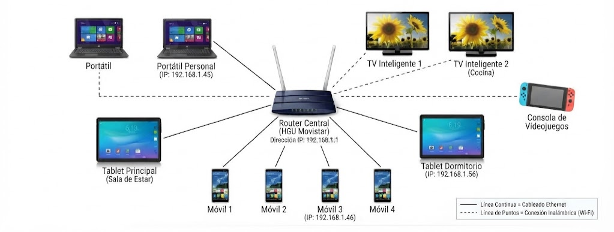
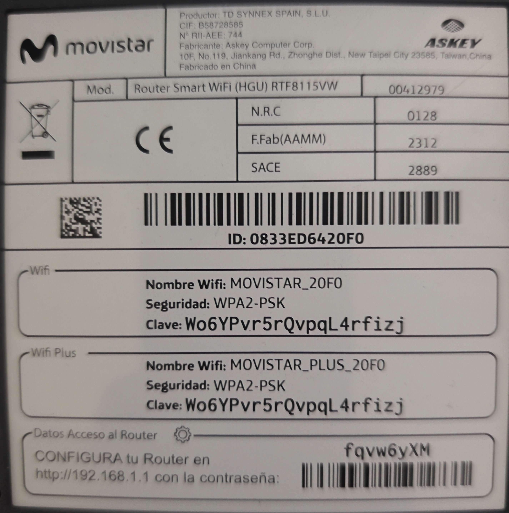

# Práctica Individual - Casa

## Práctica individual - Casa

Cada instalación se analiza de forma individual. Ambas viviendas utilizan una conexión FTTH de Movistar y una topología en estrella.

### Casa de Eulalia

#### Fibra y conectividad

La vivienda recibe fibra **monomodo** mediante FTTH con tecnología GPON. La instalación interior utiliza fibra ITU-T G.657A2, preparada para curvaturas reducidas. La roseta y el latiguillo emplean conectores **SC/APC**. El conector verde identifica el pulido angular APC.

#### Cables instalados

* **Acometida G.657A2:** conecta la CTO exterior con la roseta óptica interior.
* **Latiguillo SC/APC a SC/APC:** fibra monomodo de 9/125 µm entre roseta y puerto GPON.
* **Ethernet UTP Cat 5e/6:** enlaza el router con equipos cableados, como el descodificador.
* **Alimentación DC y RJ11:** alimentan el router y proporcionan telefonía VoIP.

#### Router y topología

El equipo principal es un **Router Smart WiFi HGU de Movistar**. Integra ONT GPON, router y punto de acceso Wi‑Fi. El descodificador UHD Movistar+ ARRIS VIP5242A se conecta al HGU mediante Ethernet.

| Elemento    | Especificación                                         |
| ----------- | ------------------------------------------------------ |
| Entrada WAN | Puerto óptico SC/APC para GPON                         |
| Red local   | Cuatro puertos Gigabit Ethernet RJ45, 10/100/1000 Mb/s |
| Telefonía   | Puerto RJ11 FXS para telefonía VoIP                    |
| Wi‑Fi       | Doble banda: Wi‑Fi 4 en 2,4 GHz y Wi‑Fi 5 en 5 GHz     |
| Indicadores | Estado de red, Internet, Wi‑Fi y teléfono              |

La dirección IPv4 observada es `192.168.1.56`. La puerta de enlace es `192.168.1.1`.

La red usa una **topología en estrella**. El HGU concentra las conexiones de ordenadores, móviles, TV y descodificador. Un fallo en un equipo no afecta al resto. Sin embargo, el router es un punto único de fallo.

### Casa de David

#### Fibra y conectividad

La vivienda recibe fibra **monomodo (SMF)** de Movistar mediante FTTH. Este medio transporta pulsos de luz desde la central hasta el hogar con baja atenuación. La acometida interior es G.657A2 y utiliza una roseta óptica.

#### Cables instalados

* **Acometida de fibra G.657A2:** conecta la red exterior con la roseta interior.
* **Latiguillo SC/APC a SC/APC:** cable monomodo amarillo de dos metros hacia el puerto GPON.
* **Ethernet UTP Cat 5e/6:** conecta dispositivos locales mediante RJ45.
* **Alimentación DC y RJ11:** alimentan el HGU y conectan la telefonía fija VoIP.

#### Router Smart WiFi HGU de Movistar

El router integra ONT GPON, router y punto de acceso Wi‑Fi en un solo equipo.

| Elemento    | Especificación                                         |
| ----------- | ------------------------------------------------------ |
| Entrada WAN | Puerto óptico SC/APC para GPON                         |
| Red local   | Cuatro puertos Gigabit Ethernet RJ45, 10/100/1000 Mb/s |
| Telefonía   | Un puerto RJ11 para línea fija                         |
| Wi‑Fi       | Doble banda: 2,4 GHz con Wi‑Fi 4 y 5 GHz con Wi‑Fi 5   |

#### Direccionamiento y topología

* **Dirección IPv4 local:** `192.168.1.46`
* **Puerta de enlace:** `192.168.1.1`
* **Topología:** estrella

Todos los equipos se conectan de forma centralizada al Router Smart WiFi. Si un dispositivo se desconecta, los demás mantienen la conectividad. Si el router falla, se interrumpen la red local y el acceso a Internet.

#### Diagrama de red

### Imágenes router

<figure><figcaption></figcaption></figure>

### Fuentes consultadas












